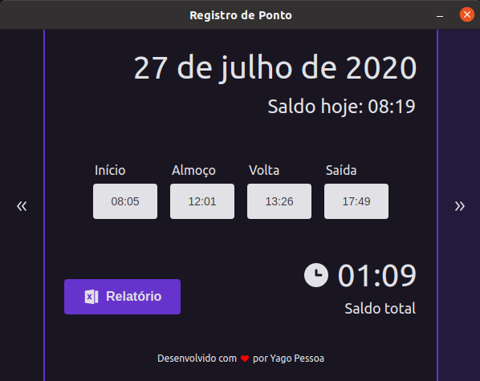

# Time Register


[](https://choosealicense.com/licenses/mit/)

> Simple app for handling work day time register.
>
> Created using Electron + TypeScript + React ([boilerplate here](https://github.com/diego3g/electron-typescript-react) by Diego3g).
> 
> Wanna try it out? Download the [**Ubuntu installer**](https://drive.google.com/file/d/18lCKw2Gk9vdI3R2TpJteXdW-rVtGh7j3/view?usp=sharing), or get the [**zipped folder for Windows**](https://drive.google.com/file/d/1XQFAXcYhe--Eo90TmE4OsQQ2fRwg65eP/view?usp=sharing) (extract the folder and create a shortcut for `time-register.exe` executable).

<p align="center">
  
</p>

## Features

This front-end features the latest tools and practices in web development!

- :electron: **Electron** — Cross-platform desktop apps with JavaScript, HTML, and CSS
- ⚛ **React** — A library to build user interfaces
- 💅 **CSS** — styled-components
- 💖 **Lint** — ESlint/Prettier/Editor Config

## Installation

Use a package manager of your choice (npm, yarn, etc.) in order to install all dependencies

```bash
yarn install
```

## Usage

In order to run this project 2 scripts will need to be executed `dev:react` and `dev:electron`, run each one in a different terminal and always run `dev:react` before `dev:electron`, or `dev` to run them in order automatically

```bash
yarn dev:react
```

```bash
yarn dev:electron
```

or

```bash
yarn dev
```

## Packaging

To generate a project package run `package`

```bash
yarn package
```

## License

[MIT](https://choosealicense.com/licenses/mit/) © [Yago Pessoa](https://www.linkedin.com/in/yagopessoa/)
